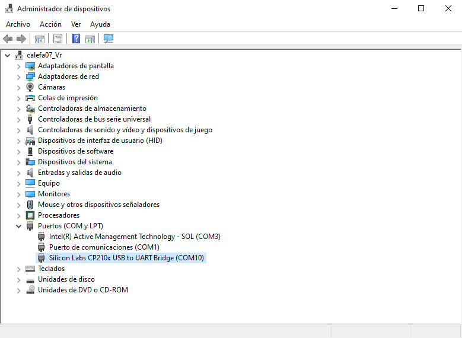

# Capítulo 1: ESP-IDF CMD

## Crear un proyecto

1. Ejecutar `cd C:\Users\achaparro\curso-dev-esp-idf`.
2. Ejecutar `idf.py create-project hola_mundo`.

Los pasos anteriores crean:

- El componente `main` que está compuesto por:
  - El archivo fuente `hola_mundo.c` que contiene la función `app_main`.
  - El archivo de registro `CmakeLists.txt`.
- Un archivo `CmakeLists.txt` para el proyecto.

3. Modificar el contenido de `hola_mundo.c`:

## Configurar el proyecto

1. Ejecutar `cd hola_mundo`.
2. Ejecutar `idf.py set-target esp32`.
3. Ejecutar `idf.py menuconfig` para abrir la interfaz de usuario `Kconfig`.
4. Ir a `Serial flasher config ---> Flash size`.
5. Seleccionar `4 MB`.

6. Presionar `ESC`.
7. Presionar `ESC`.
8. Presionar `Y`.

Los pasos anteriores crean:

- El archivo `sdkconfig` que contiene la configuración del proyecto.
- El directorio `build`.

9. Utilizar el siguiente archivo [.gitignore](https://github.com/espressif/esp-idf/blob/release/v5.2/.gitignore) para no observar la carpeta `build` con Git.

## Compilar el proyecto

1. Ejecutar `idf.py all`.

El paso anterior crea los archivos binarios del proyecto:

- `partition-table.bin`.
- `bootloader.bin`.
- `hola_mundo.bin`.

## Grabar el proyecto

1. Encontrar el puerto serial asociado al ESP-32 en el `Administrador de Dispositivos` de Windows.

2. Mantener presionado el botón `IO0`.
3. Ejecutar `idf.py -p COM10 flash`.
4. Liberar el botón `IO0`.

Los pasos anteriores:

- Reinician al ESP-32 en el modo `DOWNLOAD_BOOT`.
- Graban los archivos binarios del proyecto en la memoria Flash del SoC.

## Utilizar el monitor

1. Ejecutar `idf.py -p COM10 monitor`.

El paso anterior reinicia al ESP-32 en el `SPI_FAST_FLASH_BOOT`.

2. Presionar `CTRL+]` para cerrar el monitor.

## Documentación oficial

- [IDF Frontend - idf.py](https://docs.espressif.com/projects/esp-idf/en/v5.2.2/esp32/api-guides/tools/idf-py.html).
- [IDF Monitor](https://docs.espressif.com/projects/esp-idf/en/v5.2.2/esp32/api-guides/tools/idf-monitor.html).
