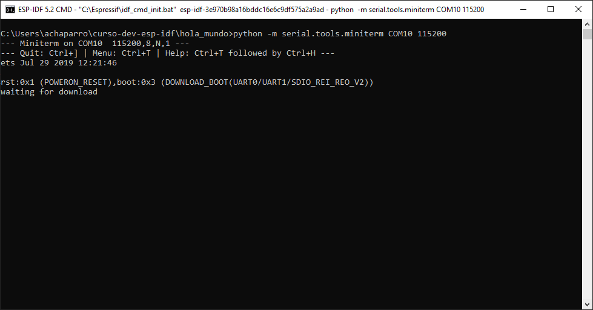
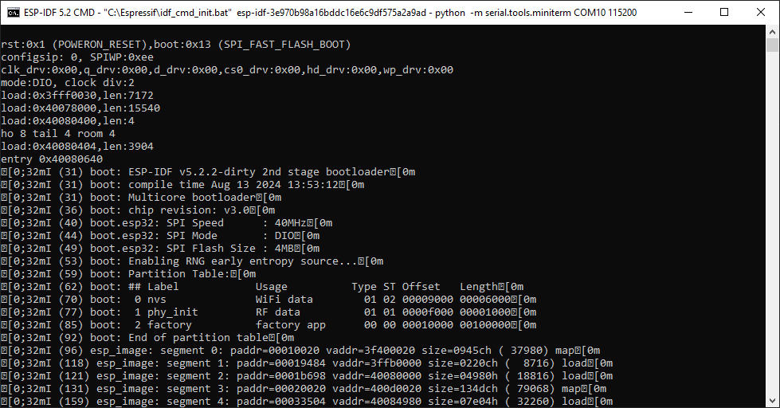
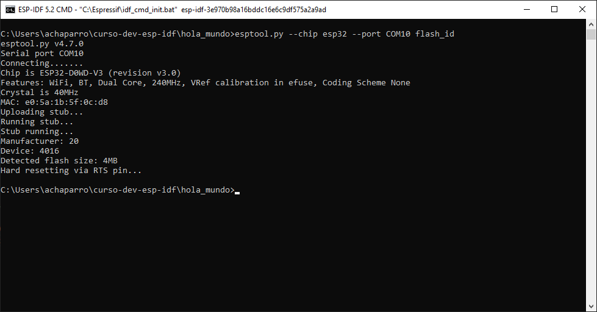
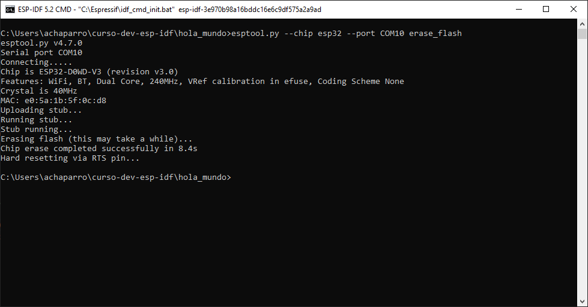
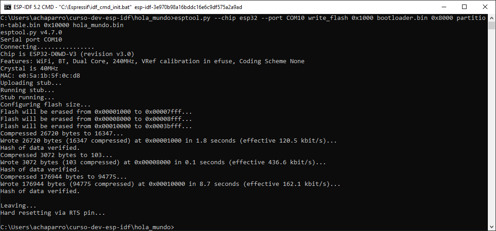

# Capítulo 2: Esptool.py

## Reiniciar al ESP-32 en el modo DOWNLOAD_BOOT o SPI_FAST_FLASH_BOOT

1. Ejecutar `python -m serial.tools.miniterm COM10 115200`.
2. Mantener presionado el botón `IO0`.
3. Presionar el botón `EN` durante 1 segundo y liberarlo.
4. Liberar el botón `IO0`.

5. Presionar el botón `EN` durante 1 segundo y liberarlo.

## Obtener las características del ESP32

1. Mantener presionado el botón `IO0`.
2. Ejecutar `esptool.py --chip esp32 --port COM10 flash_id`.
3. Liberar el botón `IO0`.

## Borrar la memoria flash

1. Mantener presionado el botón `IO0`.
2. Ejecutar `esptool.py --chip esp32 --port COM10 erase_flash`.
3. Liberar el botón `IO0`.

## Grabar los archivos binarios del proyecto

1. Copiar el archivo `bootloader.bin` que está en `build/bootloader` al directorio actual.
2. Copiar el archivo `partition-table.bin` que está en `build/partition_table` al directorio actual.
3. Copiar el archivo `hola_mundo.bin` que está en `build` al directorio actual.
4. Mantener presionado el botón `IO0`.
5. Ejecutar `esptool.py --chip esp32 --port COM10 write_flash 0x1000 bootloader.bin 0x8000 partition-table.bin 0x10000 hola_mundo.bin`.
6. Liberar el botón `IO0`.

## Documentación oficial

- [Boot Mode Selection](https://docs.espressif.com/projects/esptool/en/latest/esp32/advanced-topics/boot-mode-selection.html).
- [Esptool.py Documentation](https://docs.espressif.com/projects/esptool/en/latest/esp32/).
