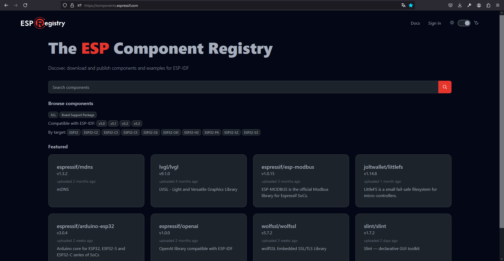

# Capítulo 3: IDF Component Manager

El sitio [The ESP Component Registry](https://components.espressif.com/) almacena componentes que podemos utilizar en nuestros proyectos.



## Crear el proyecto **leer_pulsador**

1. Abrir la `ESP-IDF CMD`.
2. Ejecutar `cd C:\Users\achaparro\curso-dev-esp-idf`.
3. Ejecutar `idf.py create-project leer_pulsador`.
4. Ejecutar `cd leer_pulsador`.
5. Ejecutar `idf.py set-target esp32`.
6. Ejecutar `idf.py menuconfig`.
7. Ir a `Serial flasher config ---> Flash size`.
8. Seleccionar `4 MB`.
9. Presionar `ESC`.
10. Presionar `ESC`.
11. Presionar `Y`.
12. Ejecutar `code .`.
13. Presionar `CTRL+SHIFT+P`.
14. Seleccionar `ESP-IDF: Add vscode Configuration Folder`.

## Agregar el componente [espressif/button](https://components.espressif.com/components/espressif/button/versions/3.3.1)

1. Abrir el sitio [The ESP Component Registry](https://components.espressif.com/).
2. Buscar el componente [espressif/button](https://components.espressif.com/components/espressif/button/versions/3.3.1).
3. Copiar el comando que está debajo el texto `To add this component to your project, run:`:

```
idf.py add-dependency "espressif/button^3.3.1"
```

4. Pegar el comando en la `ESP-IDF CMD`.
5. Presionar `ENTER`.

Los pasos anteriores crean el archivo de manifiesto `idf_component.yml` para el componente `main`. En este archivo, se declaran los componentes del [The ESP Component Registry](https://components.espressif.com/) que serán dependencias de `main`:

```
## IDF Component Manager Manifest File
dependencies:
  espressif/button: "^3.3.1"
  ## Required IDF version
  idf:
    version: ">=4.1.0"
  # # Put list of dependencies here
  # # For components maintained by Espressif:
  # component: "~1.0.0"
  # # For 3rd party components:
  # username/component: ">=1.0.0,<2.0.0"
  # username2/component2:
  #   version: "~1.0.0"
  #   # For transient dependencies `public` flag can be set.
  #   # `public` flag doesn't have an effect dependencies of the `main` component.
  #   # All dependencies of `main` are public by default.
  #   public: true

```

6. Ejecutar `idf.py reconfigure`.

El paso anterior crea:

- El archivo `dependencies.lock` donde aparecen todas las dependencias.
- La carpeta `managed_components` donde se descargan todas las dependencias.

7. Utilizar el siguiente archivo [.gitignore](https://github.com/espressif/esp-idf/blob/release/v5.2/.gitignore) para no observar `dependencies.lock` y `managed_components` con Git.

## Compilar, grabar, y monitorear el proyecto

1. Ejecutar `idf.py all`.
2. Mantener presionado el botón `IO0`.
3. Ejecutar `idf.py -p COM10 flash monitor`.
4. Liberar el botón `IO0`.
5. Presionar `CTRL+]` para cerrar el monitor.

## Documentación oficial

- [IDF Component Manager](https://docs.espressif.com/projects/esp-idf/en/v5.2.2/esp32/api-guides/tools/idf-component-manager.html).
- [IDF Frontend - idf.py](https://docs.espressif.com/projects/esp-idf/en/v5.2.2/esp32/api-guides/tools/idf-py.html).
- [Button Power Save Example](https://github.com/espressif/esp-iot-solution/blob/master/examples/get-started/button_power_save/main/main.c)
