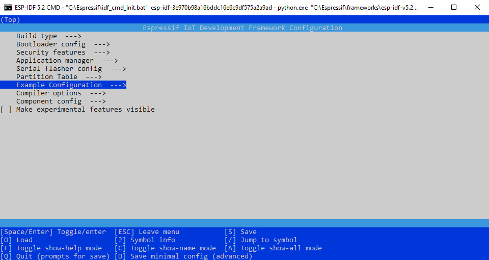
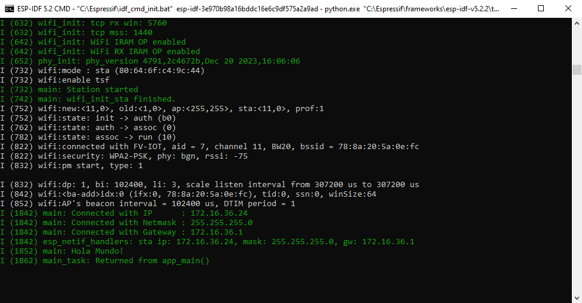

# Capítulo 4: Project Configuration

## Crear el proyecto **conexion_wifi**

1. Abrir la `ESP-IDF CMD`.
2. Ejecutar `cd C:\Users\achaparro\curso-dev-esp-idf`.
3. Ejecutar `idf.py create-project conexion_wifi`.
4. Ejecutar `cd conexion_wifi`.
5. Ejecutar `idf.py set-target esp32`.
6. Ejecutar `idf.py menuconfig`.
7. Ir a `Serial flasher config ---> Flash size`.
8. Seleccionar `4 MB`.
9. Presionar `ESC`.
10. Presionar `ESC`.
11. Presionar `Y`.
12. Ejecutar `code .`.
13. Presionar `CTRL+SHIFT+P`.
14. Seleccionar `ESP-IDF: Add vscode Configuration Folder`.
15. Copiar el contenido del archivo fuente `conexion_wifi.c` que está en el repositorio.
16. Pegar el contenido en el archivo fuente `conexion_wifi.c` del proyecto.

## Crear un menú de configuración dentro de la interfaz de usuario `Kconfig`

1. Crear el archivo `Kconfig.projbuild` dentro del componente `main`.
2. Copiar el contenido del archivo `Kconfig.projbuild` que está en el repositorio.
3. Pegar el contenido en el archivo `Kconfig.projbuild` del proyecto.
4. Ejecutar `idf.py menuconfig`.
5. Ir a `Example Configuration ---> STA Configuration ---> WiFi Remote AP SSID`.
6. Ingresar el nombre de nuestra red Wi-Fi.
7. Ir a `Example Configuration ---> STA Configuration ---> WiFi Remote AP Password`.
8. Ingresar la contraseña de nuestra red Wi-Fi.
9. Presionar `ESC`.
10. Presionar `ESC`.
11. Presionar `ESC`.
12. Presionar `Y`.

## Compilar, grabar, y monitorear el proyecto

1. Ejecutar `idf.py all`.
2. Mantener presionado el botón `IO0`.
3. Ejecutar `idf.py -p COM10 flash monitor`.
4. Liberar el botón `IO0`.
5. Presionar `CTRL+]` para cerrar el monitor.

!

## Documentación oficial

- [Project Configuration](https://docs.espressif.com/projects/esp-idf/en/v5.2.2/esp32/api-reference/kconfig.html).
- [Build System](https://docs.espressif.com/projects/esp-idf/en/v5.2.2/esp32/api-guides/build-system.html).
- [Wi-Fi](https://docs.espressif.com/projects/esp-idf/en/v5.2.2/esp32/api-reference/network/esp_wifi.html).
- [Wi-Fi Driver](https://docs.espressif.com/projects/esp-idf/en/v5.2.2/esp32/api-guides/wifi.html).
- [Wi-Fi Station Example](https://github.com/espressif/esp-idf/tree/v5.2.2/examples/wifi/getting_started/station).
- [Wi-Fi SoftAP Example](https://github.com/espressif/esp-idf/tree/v5.2.2/examples/wifi/getting_started/softAP).
- [Wi-Fi SoftAP & Station Example](https://github.com/espressif/esp-idf/tree/v5.2.2/examples/wifi/softap_sta).
- [Event Loop Library](https://docs.espressif.com/projects/esp-idf/en/v5.2.2/esp32/api-reference/system/esp_event.html).
- [Error Handling](https://docs.espressif.com/projects/esp-idf/en/v5.2.2/esp32/api-guides/error-handling.html).
- [Logging library](https://docs.espressif.com/projects/esp-idf/en/v5.2.2/esp32/api-reference/system/log.html).
- [FreeRTOS (IDF)](https://docs.espressif.com/projects/esp-idf/en/v5.2.2/esp32/api-reference/system/freertos_idf.html).
- [FreeRTOS event groups](https://wap.freertos.org/Documentation/02-Kernel/02-Kernel-features/06-Event-groups).
