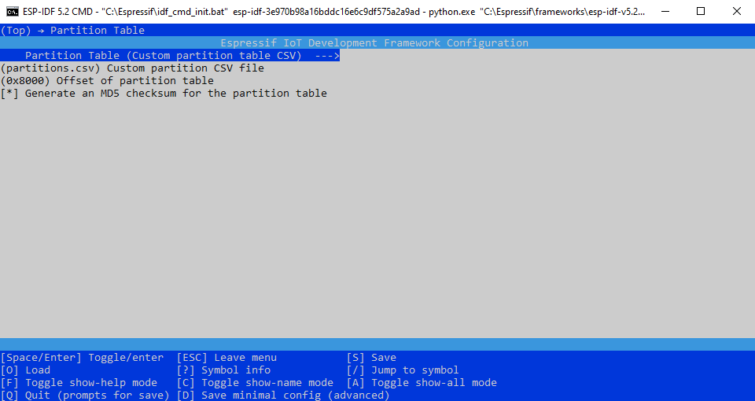
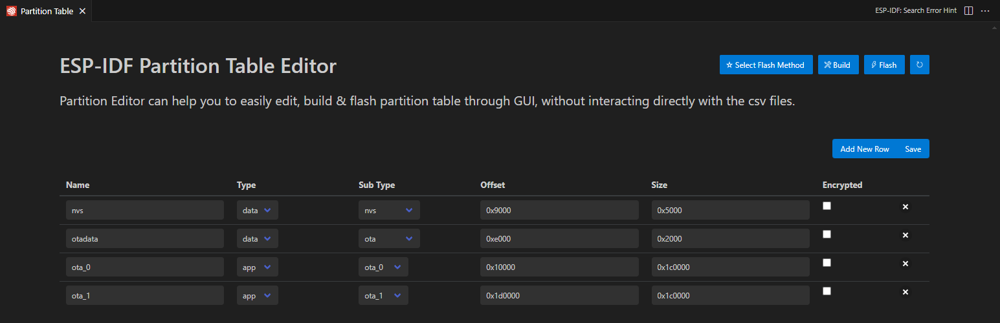

# Capítulo 6: Partition Tables

## Crear el proyecto **aprovisionamiento_ble**

1. Abrir la `ESP-IDF CMD`.
2. Ejecutar `cd C:\Users\achaparro\curso-dev-esp-idf`.
3. Ejecutar `idf.py create-project aprovisionamiento_ble`.
4. Ejecutar `cd aprovisionamiento_ble`.
5. Ejecutar `idf.py set-target esp32`.
6. Ejecutar `idf.py menuconfig`.
7. Ir a `Serial flasher config ---> Flash size`.
8. Seleccionar `4 MB`.
9. Presionar `ESC`.
10. Presionar `ESC`.
11. Presionar `Y`.
12. Ejecutar `code .`.
13. Presionar `CTRL+SHIFT+P`.
14. Seleccionar `ESP-IDF: Add vscode Configuration Folder`.

## Modificar la configuración del proyecto

1. Ejecutar `idf.py menuconfig`.
2. Ir a `Partition Table ---> Partition Table`.
3. Seleccionar `Custom partition table CSV`.

4. Presionar `ESC`.
5. Presionar `ESC`.
6. Presionar `Y`.

## Crear la nueva tabla de particiones de la memoria flash en Visual Studio Code

1. Presionar `CTRL+SHIFT+P`.
2. Seleccionar `ESP-IDF: Open Partition Table Editor UI`.
3. Crear la siguiente tabla en el `ESP-IDF Partition Table Editor`:

4. Clic en `Save`.
5. Ejecutar `idf.py partition-table`.

Los pasos anteriores crean:

- El archivo `partitions.csv` que contiene la tabla.
- Un nuevo archivo binario `partition-table.bin` para grabar en el ESP-32.

## Documentación oficial

- [Partitions API](https://docs.espressif.com/projects/esp-idf/en/v5.2.2/esp32/api-reference/storage/partition.html).
- [Partition Tables](https://docs.espressif.com/projects/esp-idf/en/v5.2.2/esp32/api-guides/partition-tables.html).
