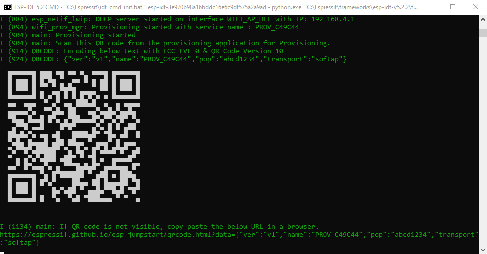
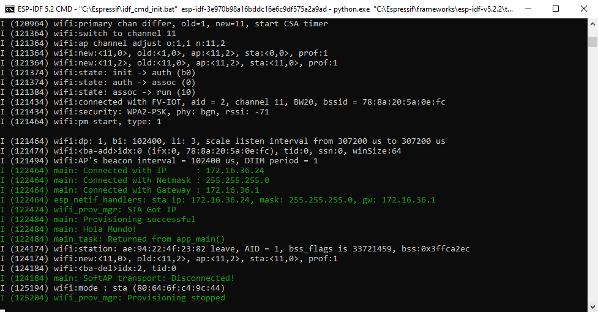

# Capítulo 6: Provisioning

## Modificar el proyecto **aprovisionamiento_wifi**

1. Abrir la `ESP-IDF CMD`.
2. Ejecutar `cd C:\Users\achaparro\curso-dev-esp-idf`.
3. Ejecutar `cd aprovisionamiento_wifi`.
4. Abrir el sitio [espressif/button](https://components.espressif.com/components/espressif/button/versions/3.3.1).
5. Copiar el comando que está debajo el texto `To add this component to your project, run:`.
6. Pegar el comando en la `ESP-IDF CMD`.
7. Presionar `ENTER`.
8. Abrir el sitio [espressif/led_indicator](https://components.espressif.com/components/espressif/led_indicator/versions/0.9.3).
9. Copiar el comando que está debajo el texto `To add this component to your project, run:`.
10. Pegar el comando en la `ESP-IDF CMD`.
11. Presionar `ENTER`.
12. Abrir el sitio [espressif/qrcode](https://components.espressif.com/components/espressif/qrcode/versions/0.1.0~2).
13. Copiar el comando que está debajo el texto `To add this component to your project, run:`.
14. Pegar el comando en la `ESP-IDF CMD`.
15. Presionar `ENTER`.
16. Ejecutar `idf.py reconfigure`.
17. Ejecutar `code .`.
18. Copiar el contenido del archivo fuente `aprovisionamiento_wifi.c` que está en el repositorio.
19. Pegar el contenido en el archivo fuente `aprovisionamiento_wifi.c` del proyecto.

## Compilar, grabar, y monitorear el proyecto

1. Instalar en nuestro smartphone la [SoftAP Provisioning app on Play Store](https://play.google.com/store/apps/details?id=com.espressif.provsoftap).
2. Ejecutar `idf.py all`.
3. Mantener presionado el botón `IO0`.
4. Ejecutar `esptool.py --chip esp32 --port COM10 erase_flash`.
5. Liberar el botón `IO0`.
6. Mantener presionado el botón `IO0`.
7. Ejecutar `idf.py -p COM10 flash monitor`.
8. Liberar el botón `IO0`.
9. Presionar `CTRL+]` para cerrar el monitor.

## Documentación oficial

- [Wi-Fi Provisioning](https://docs.espressif.com/projects/esp-idf/en/v5.2.2/esp32/api-reference/provisioning/wifi_provisioning.html).
- [Wi-Fi Provisioning Manager Example](https://github.com/espressif/esp-idf/tree/v5.2.2/examples/provisioning/wifi_prov_mgr).
- [Non-Volatile Storage Library](https://docs.espressif.com/projects/esp-idf/en/v5.2.2/esp32/api-reference/storage/nvs_flash.html).
- [LED Indicator](https://docs.espressif.com/projects/esp-iot-solution/en/latest/display/led_indicator.html).
